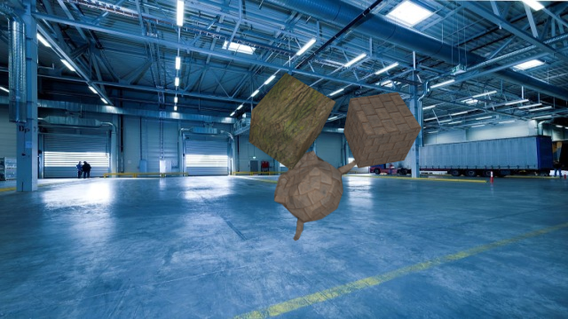

# Generating Images with Physics-Based Rendering for an Industrial Object Detection Task
This repo uses 3D-CAD models to generate synthetic training images for industrial deep-learning-based object detection tasks using Blenders ray-trace based render engine Cycles.
We generate different images by randomizing object and camera poses, lighting, background images, object texture and additional foreground objects. Additionally, we generate a JSON-file containing object detection annotations (bounding boxes) in the [COCO format](https://cocodataset.org/#format-data).

If you use this code, please cite our work:

> Eversberg, L.; Lambrecht, J. Generating Images with Physics-Based Rendering for an Industrial Object Detection Task: Realism versus Domain Randomization. Sensors 2021, 21, 7901. https://doi.org/10.3390/s21237901 
> 


## Installation
Download and unpack Blender in a folder /path/to/blender/blender-2.xx.x-linux64/ from [blender.org](https://www.blender.org/download/)
To bind the 'blender' command to the blender application execute the following command in the terminal:
```
sudo ln -s /full/path/to/blender/blender-2.xx.x-linux64/blender /usr/local/bin/blender
```

### Getting Started

#### Building Docker

```
docker build -t blender-gen .
```

#### File Structure

Set up the following folder structure (you can also use the default structure from the repo):

```
data/
    input/
        bg/
            static/
                background1.jpg
                background2.jpg
            environment/
                background3.hdr
                background4.hdr
        config/
            config.json
        models/
            Distractor1.obj
            Distractor2.obj
            Robot.obj
        textures/
            texture1.jpg
            texture2.jpg
            texture3.jpg
            texture4.jpg
```

#### Testing Setup

Run

```
mkdir -p ./data/output
docker run --gpus all --volume $(pwd)/data/input:/data/input $(pwd)/data/outpuit:/data/output
```

to test your setup.


## Usage

### Running Docker
```
mkdir -p ./data/output
docker run --gpus all --volume /path/to/input/folder/:/data/input /path/to/output/folder/:/data/output [--target target] [--endpoint url] [--mode mode] [--coco-image-root path] 
```

#### Arguments
argument | type | default | description
`--target` | `all|configure|render|merge` | "all" | Run isolated pipeline steps with this command. Running `render` & `merge` requires persistent `/data/intermediate` directory.
`--endpoint` | url | | `merge` step will `POST` current progress as `{progress:number, total:number}` object to specified endpoint. example: `http://localhost:8001`
`--mode` | `train|val` | `train` | setting to `val` overwrites `config.output.just_merge` parameter with `0`
`--coco-image-root` | path | "/data/output/dataset/" | Set `path` as prefix for path entries in the `annotation_coco.json` file.


## config.json
This python file contains a simple configuration class to configure the Blender generation script. The following parameters can be adapted to your specific application.

Parameter | Description
--------- | -----------
`input.object` | path to object model
`input.texture_object` | path to object texture
`input.distractor` | list of paths to distractor models
`input.texture_distractor` | list of paths to distractor textures
`input.bg` | list of paths to static backgrounds
`input.environment` | list of paths to 360° HDRI backgrounds
`output.images` | number of generated images
`output.just_merge` | fraction of images that is produced by `merge.py`. ([0,1], higher number means more efficiency and less dataset variety)
`output.skew_angle:material` | proportion of angle (inc, azi) samples to material (metallic, roughness) samples
`render.camera.cam_lens_unit` | Choose either 'FOV' or 'MILLIMETERS' (https://docs.blender.org/api/current/bpy.types.Camera.html#bpy.types.Camera.lens_unit)
`render.camera.cam_lens` | Camera lens value in chosen unit.
`render.camera.cam_sensor_width` | Horizontal size of the image sensor area in millimeters (https://docs.blender.org/api/current/bpy.types.Camera.html)
`render.camera.clip_end` | Camera far clipping distance (https://docs.blender.org/api/current/bpy.types.Camera.html)
`render.camera.clip_start` | Camera near clipping distance (https://docs.blender.org/api/current/bpy.types.Camera.html)
`render.resolution_x` | Pixel resolution of the output image (width)
`render.resolution_y` | Pixel resolution of the output image (height)
`render.model_scale` | model scale for .PLY models
`render.exposure` | exposure
`render.compute_bbox` | Choose _'tight'_ or _'fast'_. _Tight_ uses all vertices to compute a tight bbox but it is slower. _Fast_ uses only the 3D Bounding Box corners.
`render.use_cycles` | Boolean. If True, cycles will be used as rendering engine. If False, Eevee will be used
`render.samples` | Render engine number of samples (sets cycles.samples)
`render.use_cycles_denoising` | Boolean. If True, the rendered images are denoised afterwards (https://docs.blender.org/manual/en/latest/render/cycles/render_settings/sampling.html#denoising)
`render.use_adaptive_sampling` | Boolean. If True, adaptive sampling is used (https://docs.blender.org/manual/en/latest/render/cycles/render_settings/sampling.html#adaptive-sampling)
`render.use_GPU` | Boolean. If True, the GPU will be used for rendering
`random.distractors` | range for number of distractor objects per image
`random.x_pos` | range for x offset (in % of image width)
`random.y_pos` | range for y offset (in % of image height)
`random.z_pos` | range for y offset (in % of camera distance. distances <= -1 get clipped)
`random.inc` | range for inclination angles
`random.azi` | range for azimuth angles
`random.metallic` | range for "metallic-ness" of model texture
`random.roughness` | range for roughness/polishedness of model texture


All ranges in the last section are 2-element list [low, high]. If a constant value is desired, a scalar can be written instead of a list.
